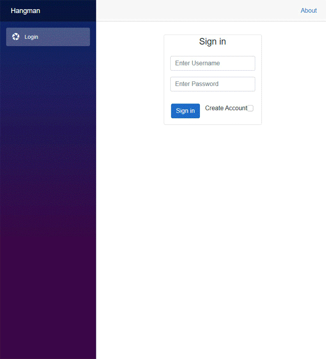

# Hangman

 

## Description
Created a web app hangman game that includes authentication, a database, and asynchronous programming with websockets
 

## Authors
Tage Higley  
Dennis Chase  
Hunter Olson  
Cecilia Harvey  

### Date
Feb 2022
 

## Tools Used
ASP.NET Core 6.0: The server side functionality uses ASP.NET Core   
Blazor: The client side was a Blazor WebAssemnbly App which work with razor pages  
SignalR: We ran our asynchronous tasks through SignalR, which mostly uses websockets  
Access Database: For the user accounts and high scores we used an Access database file   
Visual Studio: For the IDE, I used Visual Studio  
 

### Cecilia Harvey's Contributions
Password salting and hashing  
Login with SignalR  
SignalR set up and examples  
Database set up (with a lot of help from teamates, especially Dennis Chase) 
Git: Version control was managed through Git and GitHub  

### Usage
**Logging In**
- Use an existing username and password, or create a new account--or create a new account 
- Account names and passwords persist locally in an access database file
- Passwords are salted and hashed before storage in the local database
- After logging in, you will be redirected to the Hangman game. 
 

**Scoring**
- The score is displayed in the top left corner. 
- The score is the number of incorrect guesses you've made. 
- The lower the score, the better. 
 

**How to Win** 
In order to win you must successfully guess all the letters of the random word.  
You have a maximum of 5 incorrect guesses before losing the game. 
 

