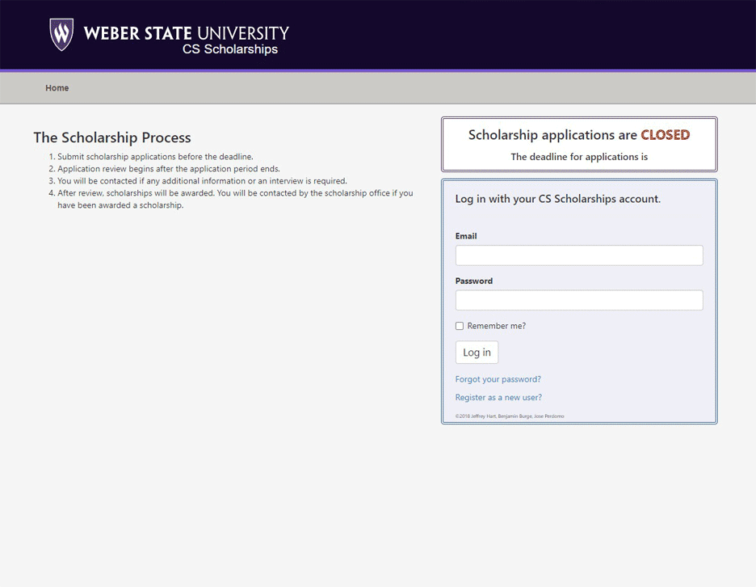

# Scholarship Application
  

## Description 
This program was a legacy application that required upgrading to a more recent version of ASP.NET Core.  
The application was upgraded from ASP.NET Core 2.0 to 6.0.  
There was a bug that prevented the Entity Framework databases from auto generating that we fixed.  
We also added a new question to the student profile.  

## Authors
Tage Higley  
Dennis Chase  
Hunter Olson  
Cecilia Harvey  

### Date 
March 2022

## Tools Used
ASP.NET Core 6.0: The serverside uses ASP.NET Core  
Blazor: The client side is based on Blazor WebAssembly app, which uses Razor pages  
SQL: The database with user information and high scores was hosted locally in a MySql database  
Entity Framework: The server side uses Entity Framework to auto create and maintain the MySql database  
Visual Studio: This is the IDE used to write the program  
Git: Version control was done through Git and GitHub  

### Cecilia Harvey's Contributions
Added a new field on the Student's profile. This required adjustments to the student profile table to add a new column and insert the new information to the database through Entity Framework. 
This also required adjustments to the Student Profile views visible from the roles of Student, Judge, and Admin.  

### Usage
**Logging In**
- Use an existing username and password, or create a new account. 
- New accounts will default to a student account type.
- After logging in, you will be redirected to the dashboard of your account type. 
- A student must complete a profile in order to apply for a scholarship.
- In order for a scholarship to exist, an administrator must add funding and a scholarship to the database.
- An admin must also have a currently open scholarship cycle in order to allow students to apply.
- An admin needs to create a form (scholarship application) for a students to apply with.
- After a student submits an application, a judge must judge the application before an admin will see that student as an option when rewarding scholarships.

**View the New Feature**
- Create a new student profile, by selecting create new account. 
- Fill out your login information and click submit.
- After successfully creating an account, you will be redirected to the student profile page. 
- In the Clubs and Organizations section you should see a question about High School STEM activities you were involved in. This is the new feature.
- After you've filled out all the required fields you may press save to save your data. 
- When you adit your Student Profile in the future, you'll see that all information has persisted, including the new field.
- You can also see this information from the Judge and Admin accounts. 
- As a judge, you can see this information when reviewing a scholarship application submitted by a student. 
- As an Admin, you can see this information when you are awarding a scholarship to a student whose application has already been judged. 
