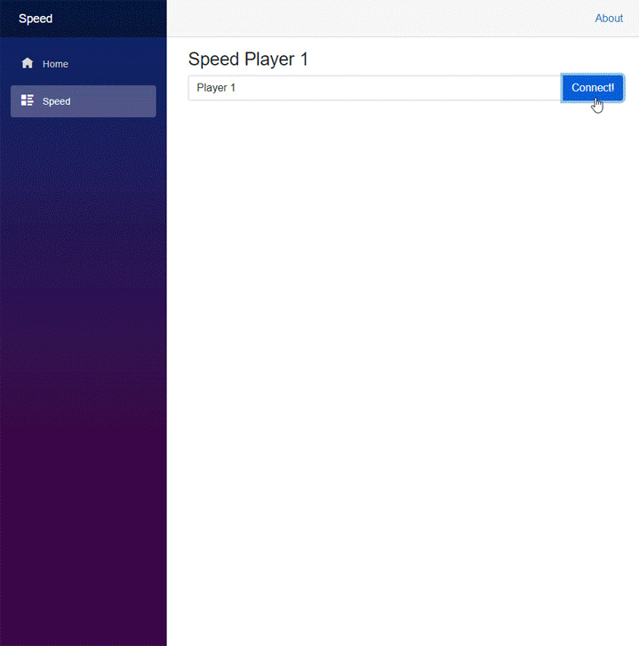

# Speed
  

## Description
Created a web app that allows two players to compete in a game of Speed.  

## Authors
Tage Higley  
Dennis Chase  
Hunter Olson  
Cecilia Harvey  

### Date
April 2022  

## Tools Used
ASP.NET Core 6.0: The server side is built on ASP.NET Core 6.0.  
Blazor: The client side is based on Blazor WebAssembly app, which uses Razor pages  
SignalR: Asynchronous tasks were created using SignalR, which mostly uses websockets.  
Visual Studio: This was the IDE used for writing the code and testing.  
Git: Version control was done through Git and GitHub  

### Cecilia Harvey's Contributions
I refactored code, to implement the MVC design model.  
I also added the feature to reshuffle and deal a new game after finishing a game, or in the event of a draw.  
I also helped troubleshoot the problems we were having with SignalR, passing objects from the Client side to the Server.  

### Usage
**Starting a game**
- Start a game, Launch the web app and then click Speed Game from the navigation menu. 
- Player 1 must add a username (it can also be left blank) and then click connect.
- Right click the browser tab and select Duplicate
- Move the new tab to a new window
- Player 2 (in the new tab) must add a username (or leave it blank) and then click connect. 
- Each player will see the same shared space (the middle row of cards), plus their own hand and draw pile
- To begin play, both players must click on one of the shared draw piles. 
- To start a new game, each player must select New Game.

**How to play**
- Play a card in your hand by discarding it to one of the two shared discard piles. 
- A card may only be played if the value of the card is one unit higher or one unit lower than the value of the card on the top of the discard pile. 
- Aces and Kings are considerd allowable plays (Aces can be discarded on a king and a king can be discarded on top of an aces)
- Suits don't matter
- If a player cannot play any cards in their hand, they can click one of the two shared draw piles. 
- When the 2nd player clicks either of the shared draw piles (after the other player has done so), a card will be pulled from each of the shared draw piles and placed on top of the shared discard piles, to continue the game. 

**How to Win** 
In order to win you must discard all of the cards in your hand and your draw pile before your opponent succeeds in doing so.
